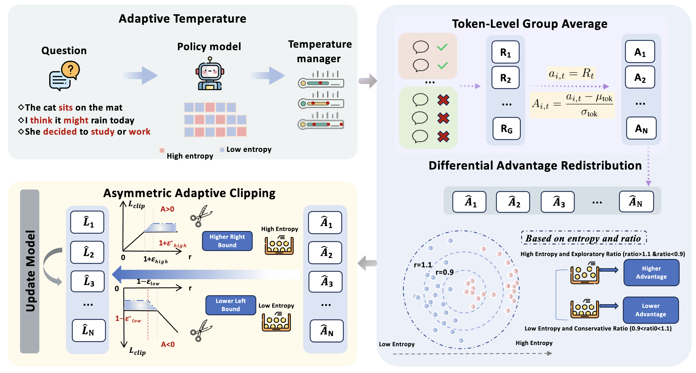
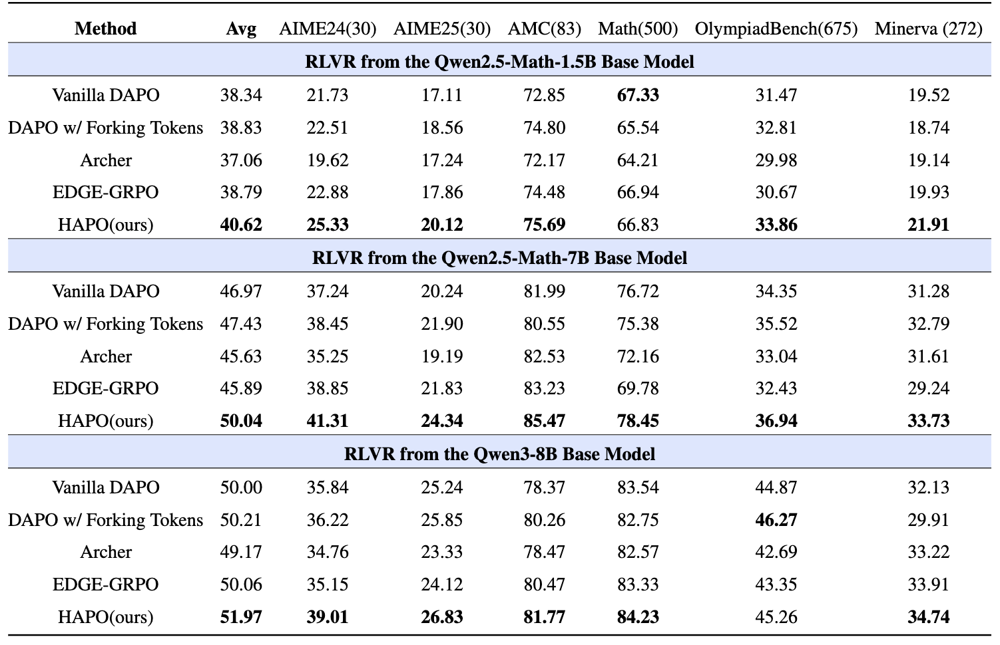
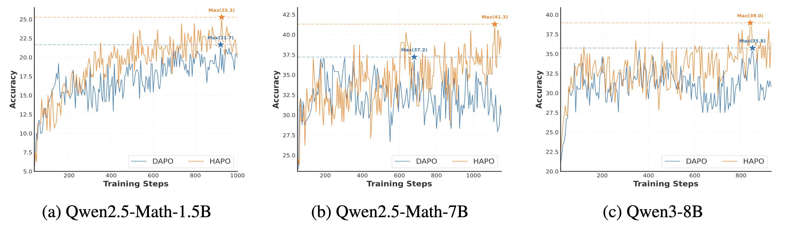
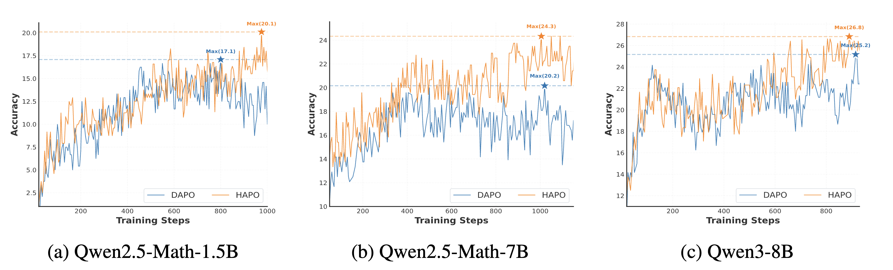
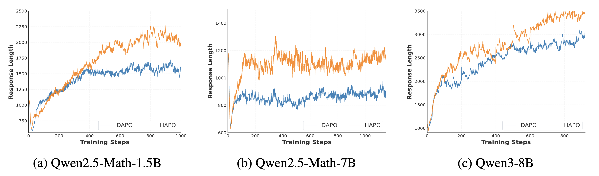
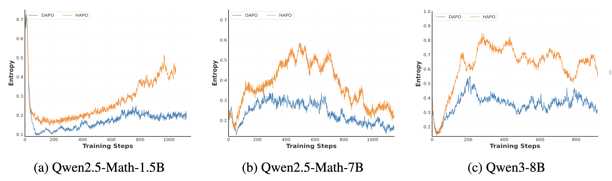

<h2 align="center">HAPO
</a>

<h5 align="center">
<div align="center">

Zheng Liu<sup>1,2*</sup>,
Mengjie Liu<sup>1,2*</sup>,
Siwei Wen<sup>3</sup>, 
Mengzhang Cai<sup>2</sup>,
[Bin Cui](https://cuibinpku.github.io/)<sup>1</sup>,
[Conghui He](https://conghui.github.io/)<sup>2</sup>,
[Lijun Wu](https://apeterswu.github.io/)<sup>2,✉</sup>,
[Wentao Zhang](https://zwt233.github.io/)<sup>1,✉</sup><br>

<sup>1</sup>Peking University,
<sup>2</sup>Shanghai AI Laboratory,
<sup>3</sup>Beihang University

</div>

<div align="center">

[](https://arxiv.org/abs/1234.12345)
[](https://huggingface.co/collections/starriver030515/hapo-68ca619d5f6dca45c1186546)
[](https://github.com/starriver030515/HAPO)

</div>

## 📰 News

- [2025-09] 🎉 Our arXiv paper [HAPO](https://arxiv.org/abs/1234.12345) is released!

##  About

Reinforcement Learning has emerged as the fundamental technique for enhancing reasoning in LLMs. However, existing algorithms apply uniform optimization to all tokens, ignoring their different roles in reasoning process. To address this limitation, we introduce **H**eterogeneous **A**daptive **P**olicy **O**ptimization (HAPO), a comprehensive token-aware algorithm that dynamically adapts optimization based on token entropy. For rollout sampling, we propose **Adaptive Temperature Sampling**, which adjusts sampling temperature in real time, promoting exploration at high-entropy tokens while preserving coherence at low-entropy ones. For advantage calculation, we introduce **Token Level Group Average** that normalizes advantages at token level, jointly accounting for sequence-length as in token-mean loss while preserving non-biased treatment. We then develop **Differential Advantage Redistribution** that leverages entropy and importance ratios to modulate rewards—adjusting updates for tokens with clear signals. For clipping loss, we design **Asymmetric Adaptive Clipping**, allowing aggressive probability reduction for noisy low-entropy tokens while enabling exploration for high-entropy tokens. Through systematic investigation between entropy and training dynamics, we embedded token-level treatment into every stages to achieve fine-grained control. Extensive experiments demonstrate that HAPO consistently outperforms DAPO across multiple model scales. 

<div align="center">

</div>


## 🛠️ Installation

1. Clone this repository and navigate to the folder
```bash
git clone https://github.com/starriver030515/HAPO
cd HAPO
```

2. Create a conda environment, activate it and install Packages
```Shell
conda create -n hapo python=3.10 -y
conda activate hapo
```

3. Execute verl installation script to install dependencies
```bash
bash scripts/install_vllm_sglang_mcore.sh
pip install -e .
```
## 📌 Usage

### Preparation

First download training and evaluation parquet from [hapo_data](https://huggingface.co/datasets/starriver030515/hapo_data).

If you use Qwen2.5 Math for training, please download [Qwen2.5-Math-1.5B-16k](https://huggingface.co/starriver030515/Qwen2.5-Math-1.5B-16k) and [Qwen2.5-Math-7B-32k](https://huggingface.co/starriver030515/Qwen2.5-Math-7B-32k), which we modified the max position length to support longer context training. For other models, you can download them from their official repository.

To support Adaptive Temperature Sampling, you need to replace the vllm-related files in your corresponding environment with those from HAPO/vllm.

### Train

Our training scripts are located in the [recipe](recipe/) folder. You only need to replace `MODEL_PATH`, `TRAIN_FILE` and `TEST_FILE`. You can see detailed parameter explanations in [train.md](recipe/train.md). 

```bash
cd recipe
bash qwen2.5_math_7b.sh
```

### Evaluation

```bash
cd scripts
bash eval_model.sh
```

## 📊 Results

Comparison between vanilla DAPO using all tokens, DAPO with forking tokens), Archer, EDGE-GRPO, and HAPO, evaluated on the Qwen-Math-1.5B Base, Qwen-Math-7B Base, and Qwen3-8B Base models. For each question, we generate 8 independent responses under a decoding temperature $T=0.5$, and report the average accuracy.

<div align="center">

</div>


##  Training Dynamics

This figure compares the training dynamics of DAPO and HAPO —with respect to four key metrics:

- **AIME24 and AIME25 Results**: HAPO consistently achieves higher accuracy across all model sizes (Qwen2.5-Math-1.5B, Qwen2.5-Math-7B, and Qwen3-8B), demonstrating superior learning efficiency and performance throughout the training process.
- **Response Length**: HAPO maintains longer response lengths during training compared to DAPO, indicating more comprehensive and detailed solution generation without compromising quality.
- **Mean Entropy**: HAPO preserves significantly higher entropy throughout training across all model configurations, demonstrating better exploration capabilities and maintaining response diversity, which prevents premature convergence to suboptimal solutions.
<div align="center">
<figure>

<figcaption><em>Figure 1: AIME24 accuracy comparison - HAPO consistently achieves higher accuracy across all model sizes</em></figcaption>
</figure>
</div>
<div align="center">
<figure>

<figcaption><em>Figure 2: AIME25 accuracy comparison - HAPO consistently achieves higher accuracy across all model sizes</em></figcaption>
</figure>
</div>

<div align="center">
<figure>

<figcaption><em>Figure 3: Response length over training steps - HAPO maintains longer, more comprehensive responses</em></figcaption>
</figure>
</div>


<div align="center">
<figure>

<figcaption><em>Figure 4: Mean entropy comparison - HAPO preserves higher entropy, indicating better exploration and diversity</em></figcaption>
</figure>
</div>


## 📝 Citation

If you find our work interesting and helpful, please consider giving our repo a star. Additionally, if you would like to cite our work, please use the following format:
```bibtex
```

## 📨 Contact

If you have any questions or suggestions, please feel free to contact us at ``2501213330@stu.pku.edu.cn``.

## ❤️ Community efforts

* This repository is based on [verl](https://github.com/volcengine/verl/tree/main) project.
